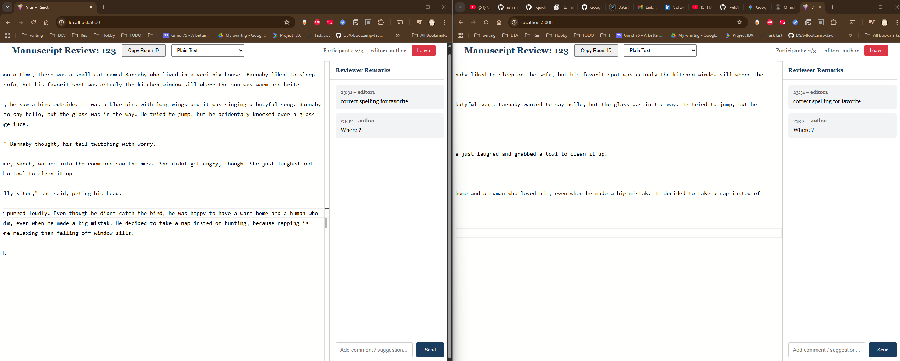

# Realtime Proof Checker

**A real-time collaborative manuscript / proof review tool for small teams (up to 3 members)**

This project provides a lightweight, real-time collaborative editor designed for reviewing academic manuscripts, mathematical proofs, technical documents, or any text that benefits from simultaneous multi-user annotation, commenting, and editing.

Currently supports **exactly 3 concurrent users** in a shared session with live updates.

## ✨ Features

- Real-time collaborative editing (multiple cursors, live changes)
- Up to 3 participants in the same document
- Simple commenting / annotation system
- Clean, distraction-free interface
- Works in the browser — no installation required for clients

## Screenshot 

## 🚀 Demo

*(Coming soon — a live demo will be linked here once deployed)*

## Tech Stack

- **Frontend**: React
- **Backend**: Node.js 
- **Real-time sync**: WebSockets ( Socket.IO )

